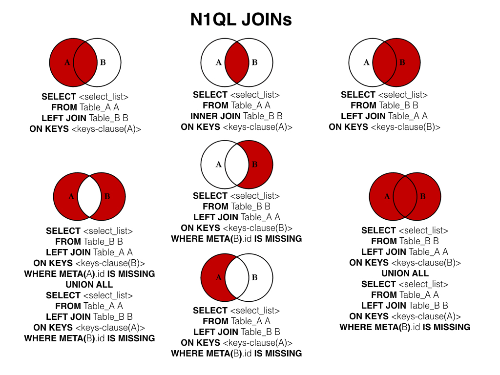

# Database

- [What is Database?](#what-is-database)
- [RDBMS Terminology](#rdbms-terminology)
- [Query](#query)
  - [Create Database](#create-database)
  - [Drop a Database](#drop-a-database)
  - [Select Database](#select-database)
  - [Data Types](#data-types)
  - [Create Table](#create-table)
  - [Drop Table](#drop-table)
  - [Insert Query](#insert-query)
  - [Select Query](#select-query)
  - [WHERE Clause](#where-clause)
  - [Update Query](#update-query)
  - [Delete Query](#delete-query)
  - [Like Clause](#like-clause)
  - [Sorting Result](#sorting-result)
  - [JOIN](#join)
  - [NULL Values](#null-values)
  - [REGEXP](#regexp)

## What is Database?

A database is a separate application that stores a collection of data. Each database has one or more distinct APIs for creating, accessing, managing, searching and replicating the data it holds.

Relational database management systems (RDBMS) - is called relational database because all the data is stored into different tables and relations are established using primary keys or other keys known as Foreign Keys.

## RDBMS Terminology

- **Database**: A database is a collection of tables, with related data.
- **Table**: A table is a matrix with data. A table in a database looks like a simple spreadsheet.
- **Column**: One column (data element) contains data of one and the same kind, for example the column postcode.
- **Row**: A row is a group of related data, for example the data of one subscription.
- **Redundancy**: Storing data twice, redundantly to make the system faster
- **Primary Key**: A primary key is unique. A key value can not occur twice in one table. With a key, you can only fine one row.
- **Foreign Key**: A foreign key is the linking pin between two tables.
- **Compound Key**: A compound key is a key that consists of multiple columns, because one column is not sufficiently unique.
- **Index**: An index in a database resembles an index it the back of a book.
- **Referential Integrity**: Referantial Integrity makes sure that a foreign key value always points to an existing row.

## Query

### Create Database

```sql
CREATE DATABASE database_name;
```

### Drop a Database

```sql
DROP DATABASE database_name;
```

### Select Database

```sql
USE database_name;
```

### Data Types

- Numeric
  - M: the display length
  - D: the number of decimals
- Date and Time.
- String Types.

### Create Table

```sql
CREATE TABLE table_name (column_name column_type);
```

For example:
```sql
create table users(
   id INT NOT NULL AUTO_INCREMENT,
   name VARCHAR(100) NOT NULL,
   birth_day DATE,
   PRIMARY KEY ( id )
);
```

### Drop Table

```sql
DROP TABLE table_name;
```

### Insert Query

To insert data into a table

```sql
INSERT INTO table_name (field1, field2, ..., fieldN) VALUES (value1, value2, ..., valueN);
```

### Select Query

Used to fetch data from database

```sql
SELECT field1, field2, ..., fieldN FROM table_name
```

With offset and limit to get the results in position and the total of results you want.

```sql
SELECT field1, field2, ..., fieldN FROM table_name OFFSET 0 LIMIT 10
```

### WHERE Clause

Used to filter out the results

```sql
SELECT field1, field2, ..., fieldN table_name
WHERE condition1 [AND [OR]] condition2, ...
```

### Update Query

```sql
UPDATE table_name SET field1 = new-value1, field2 = new-value2
[WHERE Clause]
```

### Delete Query

```sql
DELETE FROM table_name [WHERE Clause]
```

### Like Clause

Used like **=** in `WHERE` clause, but use **LIKE** when we want to filter out all the results where the value contains some characters.

```sql
SELECT field1, field2,...fieldN table_name1
WHERE field1 LIKE condition1 [AND [OR]] filed2 = 'somevalue'
```

When **LIKE** is used along with `%` sign then it work like a meta character search.

### Sorting Result

Sort a result set by adding an **ORDER BY** clause that names the column or columns which you want to sort.

```sql
SELECT field1, field2,...fieldN table_name1
ORDER BY field1 ASC;

SELECT field1, field2,...fieldN table_name1
ORDER BY field1, field2 DESC, ASC;
```

### JOIN

Used **JOIN** to use multiple tables in single SQL query.

- LEFT JOIN
- RIGHT JOIN 
- INNER JOIN

<p align="center">
    
</p>

### NULL Values

Use **NULL** in **WHERE** clause

```sql
IS NULL
IS NOT NULL
<=>
```

### REGEXP

MySQL supports another type of pattern matching operation based on the regular expressions and the **REGEXP** operator

| Patter         | What the pattern matches                               |
| -------------- | ------------------------------------------------------ |
| ^              | Beginning of string                                    |
| $              | End of string                                          |
| .              | Any single character                                   |
| [...]          | Any character listed between the square brackets       |
| [^...]         | Any character not listed between the square brackets   |
| p1 or p2 or p3 | Alternation; matches any of the patterns p1, p2, or p3 |
| *              | Zero or more instances of preceding element            |
| +              | One or more instances of preceding element             |
| {n}            | n instances of preceding element                       |
| {m,n}          | m through n instances of preceding element             |

[Image 1]: ../img/sql.join.jpeg