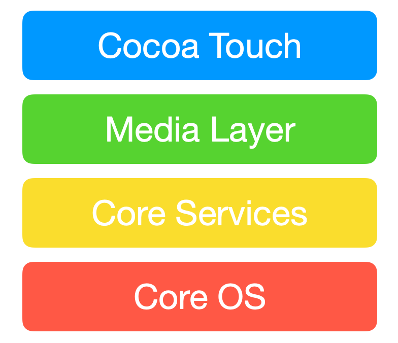
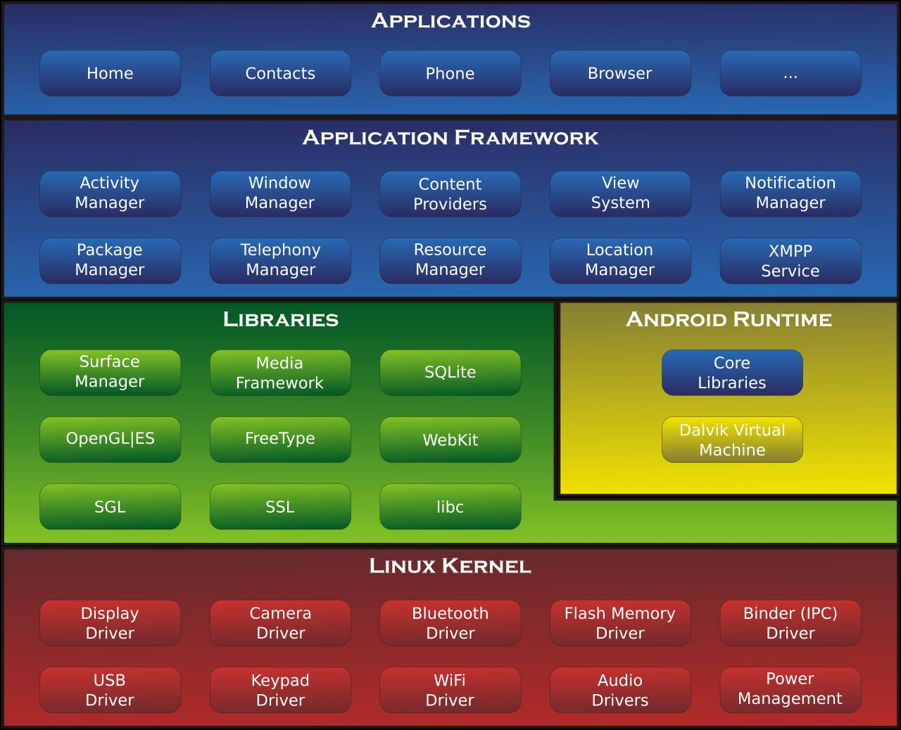

# Mobile Technology

- [iOS Architecture](#ios-architecture)
  - [Core OS Layer](#core-os-layer)
  - [Core Service Layer](#core-service-layer)
  - [Media Layer](#media-layer)
  - [Cocoa Touch Layer](#cocoa-touch-layer)
- [Android Architecture](#android-architecture)

## iOS Architecture

Architecture of iOS is a layered architecture. At the uppermost level iOS works as an intermediary between the underlying handware and the apps you make. Apps do not communicate to the underlying hardware directly.

Apps talk with the hardware through a collection of well defined system interfaces. These interfaces make it simple to write apps that work constantly on devices having various hardware abilities.

    

Lower layers gives the basic services which all application relies on and higher level gives sophisticated graphics and interface related services.

Apple provides mosst of its system interfaces in special packages called framework. Every layer have a set of Framework which the developer use to construct the applications.

### Core OS Layer

- Core Bluetooth Framework
- Accelerate Framework
- External Accessory Framework
- Security Services Framework
- Local Authentication Framework
- ...

### Core Service Layer

Some of the important framework:
- Address Book Framework
- Cloud Kit Framework
- Core Data Framework
- Core Foundation Framework
- Core Location Framework
- Core Motion Framework
- Foundation Framework
- Healthkit Framework
- Homekit Framework
- Social Framework
- StoreKit Framework
- ...

### Media Layer

**Graphics Frameworks**:
- UIKit Graphics
- Core Graphics Framework
- Core Animation
- Core Images
- OpenGI ES and GLKit
- Metal

**Audio Frameworks**:
- Media Player Framework
- AV Foundation
- OpenAL

**Video Frameworks**:
- AV Kit
- AV Foundation
- Core Media

### Cocoa Touch Layer

- EventKit Framework
- GameKit Framework
- iAd Framework
- MapKit Framework
- PushKit Framework
- UIKit Framework

## Android Architecture

    

[iOS Architecture]: ../img/mt.ios.arch.png
[Android Architecture]: ../img/mt.android.arch.png