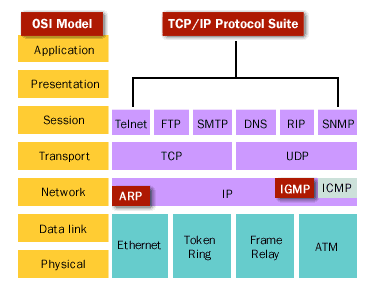
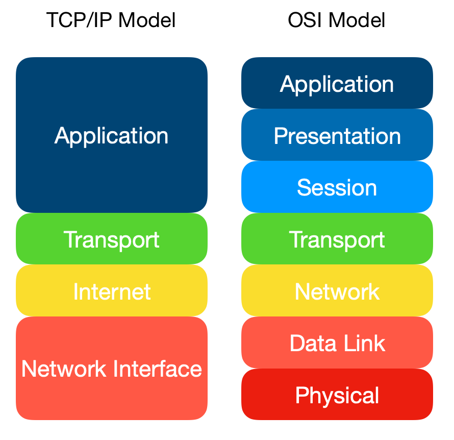
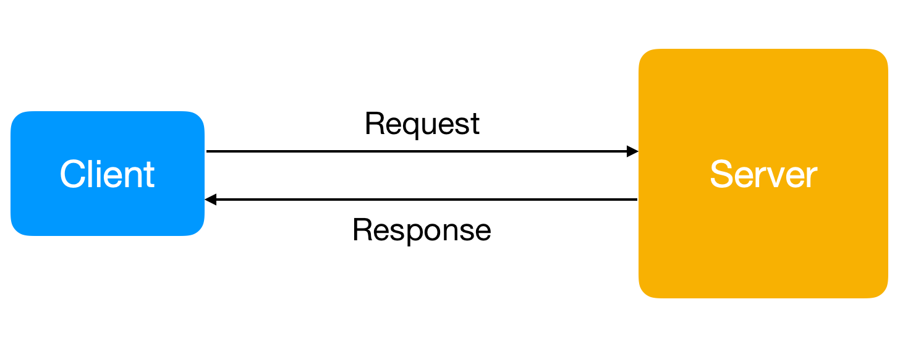
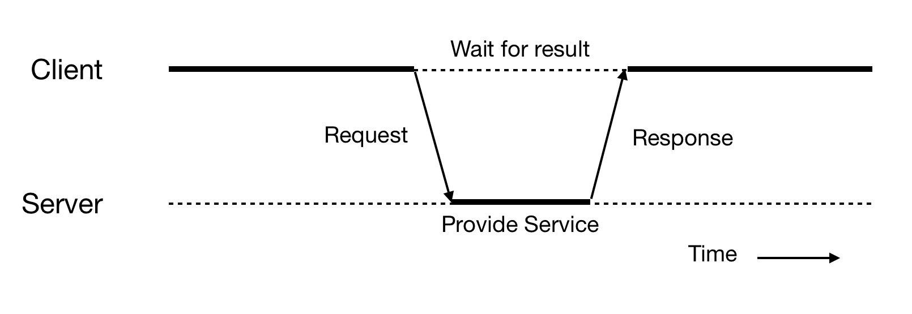

# Network Programming

- [Introduction](#introduction)
  - [Network Architecture](#network-architecture)
  - [Network Programming](#network-programming)
  - [Types of Network](#types-of-network)
  - [Operating System](#operating-system)
  - [Protocols](#protocols)
- [Models of Network](#models-of-network)
  - [OSI Model](#osi-model)
  - [TCP/IP Model](#tcpip-model)
  - [Internet Layer](#internet-layer)
  - [Network Interface Layer / Link Layer](#network-interface-layer--link-layer)
- [Server/Client Model](#serverclient-model)
  - [Client](#client)
  - [Server](#server)
  - [Activity](#activity)
- [Programming with TCP](#programming-with-tcp)
- [Programming with UDP](#programming-with-udp)
- [Programming with Multi-Thread](#programming-with-multi-thread)
- [Programming with Database](#programming-with-database)

## Introduction

### Network Architecture

Netowrk Architecture is the design of a computer network.

#### Network topology: 

The arrangement of a network which comprises of nodes and connecting lines via sender and receiver.

    

#### Layered Architecture

The basic idea of a layered architecture is to divide the design into smaill peaces.

System of network protocol consists:

- Hardwares
- Software

For example: OSI or TCP/IP Model Layers
  
### Network Programming

Network programming is create entity softwares that working on a particular layer. Using softwares of lower layer and provide services for higher layer.

People usually create entity software for `application layer`, provide services for user.

### Types of Network

#### LAN

- Bandwidth: High
- Error rate: Low
- Appropriate with applications: Email, File Transfer, Database application, Multi-media transfer.

#### WAN

- Install techniques: 
  - Lease-line, Frame-relay, ISDN, ATM...
  - Each technique have different bandwidth
- Applications: Data Communication, VoIP,...

#### Internet
- Unstable and unsafe compared with LAN and WAN
- Applications: Email, Web, E-Commerce, Game Online
- Cyber network security

### Operating System

One Network Application works on one or more computer systems.

To work, the application needs an operating environment and the most important environment is: Operating System.

- UNIX
- LINUX
- Windows
- macOS

### Protocols

- TCP/IP suite

    

## Models of Network

### OSI Model

    

#### Physical Layer

Concerned with the transmission and reception of the unstructured raw bit stream over the physical medium.

See more

- **Application**: 
  - **Physical structure** Cables, Hubs, ect.

- **Example**:
  - Data Encoding
  - Physical medium attachment
  - Tranmission technique
  - Baseband or Broadband
  - Physical medium transmission Bits & Volts

- **Central Device**:
  - Hub

- **Protocols**: 
  - 100BASE-T
  - 1000BASE-T
  - 802.11

#### Data Link Layer

Provides error-free transfer of data frames from one node to another over the Physical layer

See more

- **Application**: 
  - **Frames** ("envelopes", contains MAC address) [NIC card ---- Switch ---- NIC card] (end to end)

- **Example**:
  - Establishes & terminates the logical link between nodes
  - Frame traffic control
  - Frame squencing
  - Frame acknowledgment
  - Frame delimiting
  - Frame error checking
  - Media access control

- **Central Device**:
  - Switch
  - Bridge
  - WAP

- **Protocols**: 
  - PPP/SLIP
  - Ethernet
  - Token Ring
  - ISDN

#### Network Layer

Controls the operations of the subnet, deciding which physical path the data takes.

See more

- **Application**: 
  - **Packets** ("letter", contains IP address)

- **Example**:
  - Routing
  - Subnet traffic control
  - Frame fragmentation
  - Logical-physical addess mapping
  - Subnet usage accounting

- **Central Device**:
  - Routers

- **Protocols**: 
  - IP/IPX/ICMP

#### Transport Layer

Ensures that messages are delivered error-free, in sequence, and with no looses or duplications.

See more

- **Application**: 
  - **TCP** Host to Host, Flow Control

- **Example**:
  - Message segmentation
  - Message acknowledgement
  - Message traffic control
  - Session multiplexing

- **Central Device**: _None_

- **Protocols**: 
  - TCP/SPX/UDP

#### Session Layer

Allow session astablishment between processes running on different stations

See more

- **Application**: 
  - **Synch & Send to Ports** (logical ports)

- **Example**:
  - Session establishment
  - Maintenance and termination
  - Session Support
  - Perform Security
  - Name Recognition
  - Logging

- **Central Device**:
  - Logical Ports

- **Protocols**: 
  - RPC/SQL/NFS/NetBIOS
  - SSH

#### Presentation Layer

Formats the data to be presented to the Application layer. It can be viewed as the "Translator" for the network

See more

- **Application**: 
  - **Syntax layer** encrypt and decrypt (if needed)

- **Example**:
  - Character code translation
  - Data conversion
  - Data compression
  - Data encryption
  - Character Set Translation

- **Central Device**: _None_

- **Protocols**: 
  - JPEG/ASCII/EBDIC/TIFF/GIF/PICT
  - SMB, NCP

#### Application Layer

Serves as the window for users and application processes to access the network services

See more

- **Application**: 
  - **End User Layer** Program that opens what was sent or creates what is to be sent

- **Example**:
  - Resource sharing
  - Remote file access
  - Remote printer access
  - Directory services
  - Network management

- **Central Device**: 
  - User Application

- **Protocols**: 
  - SMTP
  - HTTP, FTP, NSF, Telnet, SSH, ECHO,...

### TCP/IP Model

    

#### Application Layer

The **application layer** is the scope within which applications, or processes, create user data and communicate this data to other applications on another or the same host.

#### Transport Layer

The **transport layer** performs host-to-host commnunications on either the same or different hosts and on either the local network or remote networks separated by routers.

It provides a channel for the communitation needs of applications. UDP is the basic transport layer protocol, providing an unreliable datagram service.

### Internet Layer

The **internet layer** exchanges datagrams across network boundaries. It provides a uniform networking interface that hides the actual topology of the underlying network connections.

### Network Interface Layer / Link Layer

The layer defines the networking methods within the scope of the local netowrk link on which hosts communicate without intervening routers. This layer includes the protocols used to describe the local network topology and the interfaces needed to affect transmission of Internet layer datagrams to next-neighbor hosts.

## Server/Client Model

    

### Client

- Create a connection to the server (speaks first)
- Request a particular service from the server
- With web, client is into the web browser

### Server

- Provide requested service for the client

### Activity

    

## Programming with TCP

## Programming with UDP

## Programming with Multi-Thread

## Programming with Database

[Network Topology]: ../img/np.network.topology.png
[TCP/IP Suite]: ../img/np.tcpip.suite.png
[OSI Model]: ../img/np.osi.model.png
[TCP/IP Model]: ../img/np.tcpip.model.png
[Client And Server]: ../img/np.cns.png
[CnS Activity]: ../img/np.cns.activity.png