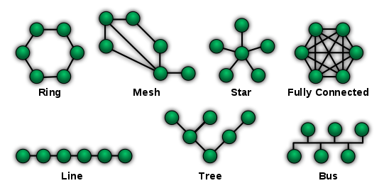
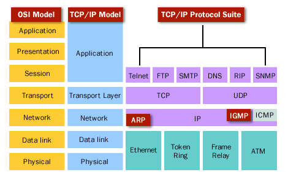

# Network Programming

- [Introduction](#introduction)
  - [Network Architecture](#network-architecture)
  - [Network Programming](#network-programming)
  - [Types of Network](#types-of-network)
  - [Operating System](#operating-system)
  - [Protocols](#protocols)
- [Models of Network](#models-of-network)
  - [OSI Model](#osi-model)
- [Server/Client Model](#serverclient-model)
- [Programming with TCP](#programming-with-tcp)
- [Programming with UDP](#programming-with-udp)
- [Programming with Multi-Thread](#programming-with-multi-thread)
- [Programming with Database](#programming-with-database)

## Introduction

### Network Architecture

Netowrk Architecture is the design of a computer network.

#### Network topology: 

The arrangement of a network which comprises of nodes and connecting lines via sender and receiver.

    

#### Layered Architecture

The basic idea of a layered architecture is to divide the design into smaill peaces.

System of network protocol consists:

- Hardwares
- Software

For example: OSI or TCP/IP Model Layers
  
### Network Programming

Network programming is create entity softwares that working on a particular layer. Using softwares of lower layer and provide services for higher layer.

People usually create entity software for `application layer`, provide services for user.

### Types of Network

#### LAN

- Bandwidth: High
- Error rate: Low
- Appropriate with applications: Email, File Transfer, Database application, Multi-media transfer.

#### WAN

- Install techniques: 
  - Lease-line, Frame-relay, ISDN, ATM...
  - Each technique have different bandwidth
- Applications: Data Communication, VoIP,...

#### Internet
- Unstable and unsafe compared with LAN and WAN
- Applications: Email, Web, E-Commerce, Game Online
- Cyber network security

### Operating System

One Network Application works on one or more computer systems.

To work, the application needs an operating environment and the most important environment is: Operating System.

- UNIX
- LINUX
- Windows
- macOS

### Protocols

- TCP/IP suite

    

## Models of Network

### OSI Model

    

#### Physical Layer

Concerned with the transmission and reception of the unstructured raw bit stream over the physical medium.

- **Application**: 
  - **Physical structure** Cables, Hubs, ect.

- **Example**:
  - Data Encoding
  - Physical medium attachment
  - Tranmission technique
  - Baseband or Broadband
  - Physical medium transmission Bits & Volts

- **Central Device**:
  - Hub

- **Protocols**: 
  - 100BASE-T
  - 1000BASE-T
  - 802.11

#### Data Link Layer

Provides error-free transfer of data frames from one node to another over the Physical layer

- **Application**: 
  - **Frames** ("envelopes", contains MAC address) [NIC card ---- Switch ---- NIC card] (end to end)

- **Example**:
  - Establishes & terminates the logical link between nodes
  - Frame traffic control
  - Frame squencing
  - Frame acknowledgment
  - Frame delimiting
  - Frame error checking
  - Media access control

- **Central Device**:
  - Switch
  - Bridge
  - WAP

- **Protocols**: 
  - PPP/SLIP
  - Ethernet
  - Token Ring
  - ISDN

#### Network Layer

Controls the operations of the subnet, deciding which physical path the data takes.

- **Application**: 
  - **Packets** ("letter", contains IP address)

- **Example**:
  - Routing
  - Subnet traffic control
  - Frame fragmentation
  - Logical-physical addess mapping
  - Subnet usage accounting

- **Central Device**:
  - Routers

- **Protocols**: 
  - IP/IPX/ICMP

#### Transport Layer

Ensures that messages are delivered error-free, in sequence, and with no looses or duplications.

- **Application**: 
  - **TCP** Host to Host, Flow Control

- **Example**:
  - Message segmentation
  - Message acknowledgement
  - Message traffic control
  - Session multiplexing

- **Central Device**: _None_

- **Protocols**: 
  - TCP/SPX/UDP

#### Session Layer

Allow session astablishment between processes running on different stations

- **Application**: 
  - **Synch & Send to Ports** (logical ports)

- **Example**:
  - Session establishment
  - Maintenance and termination
  - Session Support
  - Perform Security
  - Name Recognition
  - Logging

- **Central Device**:
  - Logical Ports

- **Protocols**: 
  - RPC/SQL/NFS/NetBIOS
  - SSH

#### Presentation Layer

Formats the data to be presented to the Application layer. It can be viewed as the "Translator" for the network

- **Application**: 
  - **Syntax layer** encrypt and decrypt (if needed)

- **Example**:
  - Character code translation
  - Data conversion
  - Data compression
  - Data encryption
  - Character Set Translation

- **Central Device**: _None_

- **Protocols**: 
  - JPEG/ASCII/EBDIC/TIFF/GIF/PICT
  - SMB, NCP

#### Application Layer

Serves as the window for users and application processes to access the network services

See more

- **Application**: 
  - **End User Layer** Program that opens what was sent or creates what is to be sent

- **Example**:
  - Resource sharing
  - Remote file access
  - Remote printer access
  - Directory services
  - Network management

- **Central Device**: 
  - User Application

- **Protocols**: 
  - SMTP
  - HTTP, FTP, NSF, Telnet, SSH, ECHO,...

## Server/Client Model

## Programming with TCP

## Programming with UDP

## Programming with Multi-Thread

## Programming with Database

[Network Topology]: ../img/np.network.topology.png
[TCP/IP Suite]: ../img/np.tcpip.suite.gif
[OSI Model]: ../img/np.osi.model.png