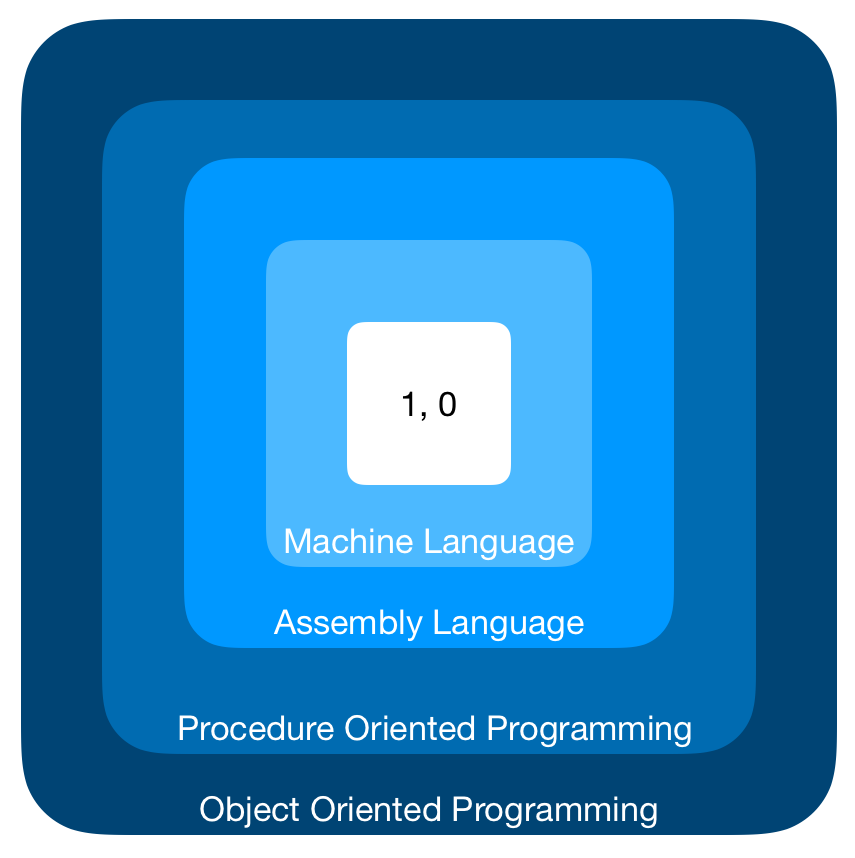
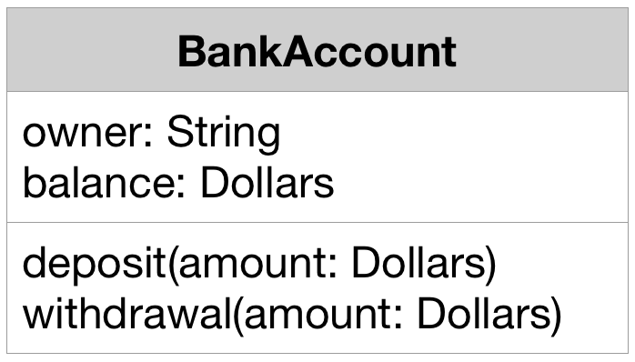

# Object Oriented Programming

- [Software crisis](#software-crisis)
- [Software Evaluation](#software-evaluation)
- [POP (Procedure Oriented Programming)](#pop-procedure-oriented-programming)
- [OOP (Object Oriented Programming)](#oop-object-oriented-programming)
- [Basic concepts of OOP](#basic-concepts-of-oop)
  - [Objects](#objects)
  - [Classes](#classes)
  - [Abstraction](#abstraction)
  - [Encapsulation](#encapsulation)
  - [Inheritance](#inheritance)
  - [Polymorphism](#polymorphism)
  - [Dynamic Binding](#dynamic-binding)
  - [Message Passing](#message-passing)
- [Benefits of OOP](#benefits-of-oop)
- [Object Oriented Language](#object-oriented-language)
- [Application of OOP](#application-of-oop)

## Software crisis

Sofware crisis:
- How to represent real-life entities of problems in system design?
- How to design system with open interfaces?
- How to ensure reusability and extensibility of modules?
- How to develop modules that are tolerant of any changes in future?
- How to improve software productivity and decrease software cost?
- How to improve the quality of software?
- How to manage time schedules?

## Software Evaluation

    

Like a tree, the software evolution has had distinct phases "layers" of growth. These layers were building up one by one over the last five decades.

To build today's complex software it is just not enough to put together a sequence of programming statements and sets of procedures and modules.

## POP (Procedure Oriented Programming)

POP basically consists of writing a list of instructions for the computer to follow, and organizing these instructions into groups known as functions.

Some characteristics exhibited by procedure-oriented programming:
- Emphasis is on doing things (algorithms)
- Large programs are divided into smaller programs known as functions
- Most of the functions share global data
- Data move openly around the system from function to function
- Functions transform data from one form to another
- Employs top-down approach in program design

## OOP (Object Oriented Programming)

Some of the features of object oriented programming:
- Emphasis is on data rather than procedure
- Programs are divided into what are known as objects
- Data structures are designed such that they characterize the objects
- Functions that operate on the data of an object are ties together in the data structure
- Data is hidden and cannot be accessed by external function
- Objects may communicate with each other through function
- New data and functions can be easily added whenever necessary
- Follows bottom up approach in program design

## Basic concepts of OOP

### Objects

Object are the basic run time entities in an object-oriented system. 

When you think about Objects, you should think about the real world situations. Objects could be:
- Something visible for you, like the car, phone, apple, duck, lamp.
- Something that you can't touch, like Time, Event, Account.

Each Object has it's own **attributes**, and **behavior**. Object are separate from one onther. They have their own existence, their own identity that is independent of other objects.

When a program is executed, the objects interact by sending messages to one another.

#### Attributes

Attributes is the characteristic or the properties of the Object

For example, in case of a **duck**, it's **weight** & **color**. They describe the current state of an object. The state of one object is independent of another. Maybe you will have a duck that’s white and another one is black.

#### Behavior

Behavior is things that the Object can do, in case of **duck**, it can **fly**.

So how do we construct these objects in our program? - **Class**

### Classes

A **class** is the place where you can identify the behaviors and properties of an Object. So, the properties and behavior of an Object, will be defined inside a class.

So, a class is a blueprint, it provides the definition for an Object, the definition says what are the properties and the behaviors of the Object.

    

In fact, objects are variables of the type class. Once a class has been defined, we can create any number of objects belonging to that class. However, even they share the same type class, each Object instantiated from this Class is independent on the other.

### Abstraction

Abstraction refers to the act of representing essential features without including the background details or explanation. Classes use the concept of abstraction and are defined as a list of abstract attributes and function operate on these attributes.

Abstraction means you start focusing on the common properties and behaviors of some Objects, and we automatically will discard what's unimportant or irrelevant.

> For example, what came into your mind when I say "Car"?
> 
> If we say Car, we didn’t explicitly say if the car is BMW or Audi, if it’s red or black, if it’s small or large. Your mental model of a car might have a color and size, but, it’s unlikely to have a smell or a flavor because those things are irrelevant to the idea of a car.

### Encapsulation

### Inheritance

### Polymorphism

### Dynamic Binding

### Message Passing

## Benefits of OOP

## Object Oriented Language

## Application of OOP

[Image 1]: ../img/oop.layers.png
[Image 2]: ../img/oop.class.png