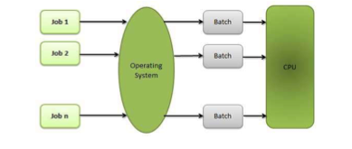
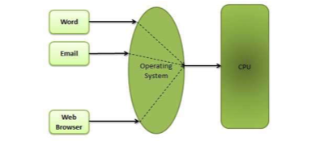
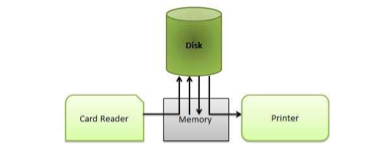

# Operating System

## Overview

## Types

### Batch OS

### Time-sharing OS

### Distributed OS

### Network OS

### Realtime OS

## Services

- Program execution
- I/O Operation
- File system manipulation
- Communication
- Error handling
- Resourc management
- Protection

## Properties

### Batch processing

### Multitasking & Multiprogramming

### Interactivity

### Realtime system

### Distributed environment

### Spooling

## Process

- Process is a program in execution
- Components of process:
	- Object program
	- Data
	- Resource
	- Status
		- New
		- Ready
		- Running
		- Waiting
		- Terminated

## Scheduling

- The process scheduling is 
	- removal of running process from CPU
	- selection another process base on particular strategy
	- allow more than 1 process to be loaded into executable memory at a time

## Multithreading

### What is thread?

- Flow of execution through the process code + program counter + system register + stack
- A way to increase performance through parallelism
- Each thread belongs to a process
- Provides a suiltable foundation for paralel execution of app on shared memory multiprocessors

### Comparison Thread >< Process

- light weigth, fewer resource
- not need interaction with OS
- all thread share same set of resource
- not waiting the previous blocked thread
- one thread can modify another thread

### Benefit

- Responsiveness
- Resource sharing
- Ecocnomy:
	- create thread time x30 = create process
	- context switch on thread time x5 = context switch on process time
- Scalability: with multiprocessor arch, thread may run in parallel on different cores

### Multicore programming ~ Multiprocessor programming

- System with single core, concurrency = execution of thread will be interleaved overtime

T1 T2 T3 T4 T1 T2 T3 T4 T1 T2 T3 T4 ...

- System with multicore, concurency = threads can run in parallel

T1 T3 T1 T3 T1 T3 ...

T2 T4 T2 T4 T2 T4 ...

Concurency: It supports more than 1 task by allowing all task to make process

Parallelism: It can perform more than 1 task simultaneously