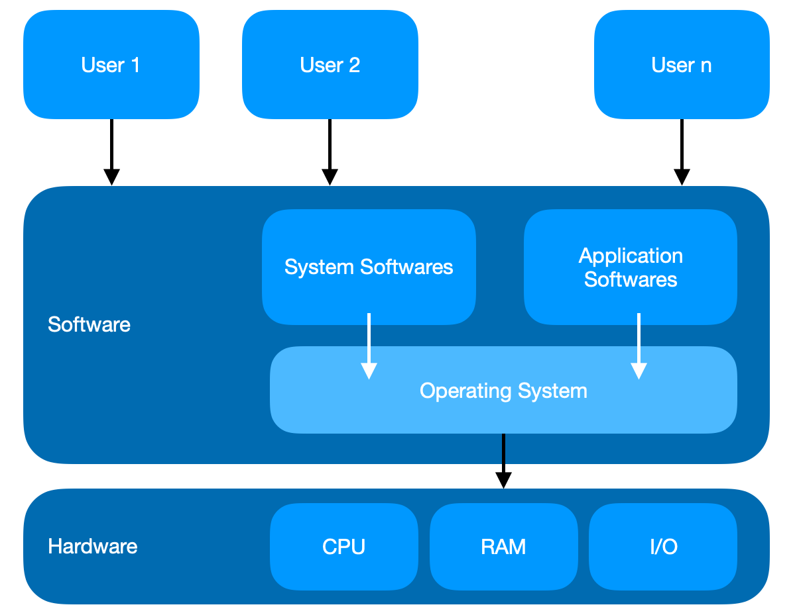
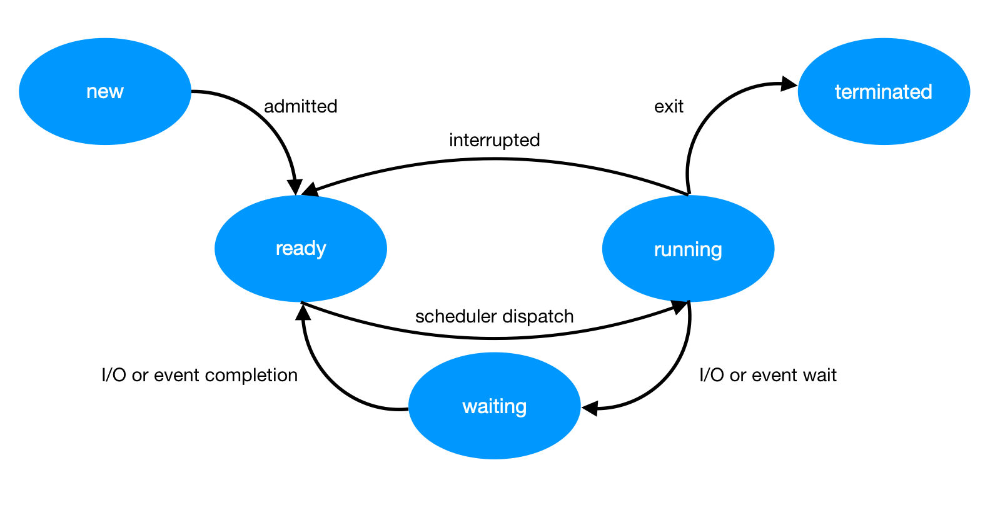
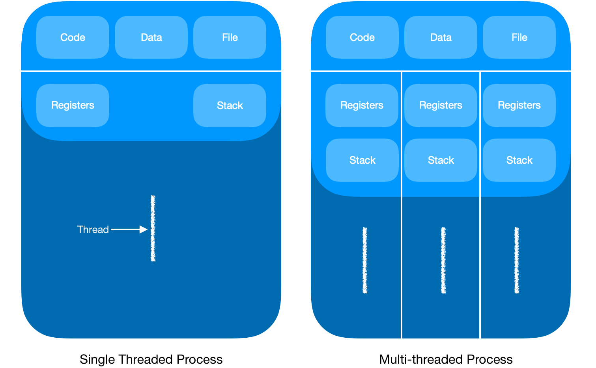
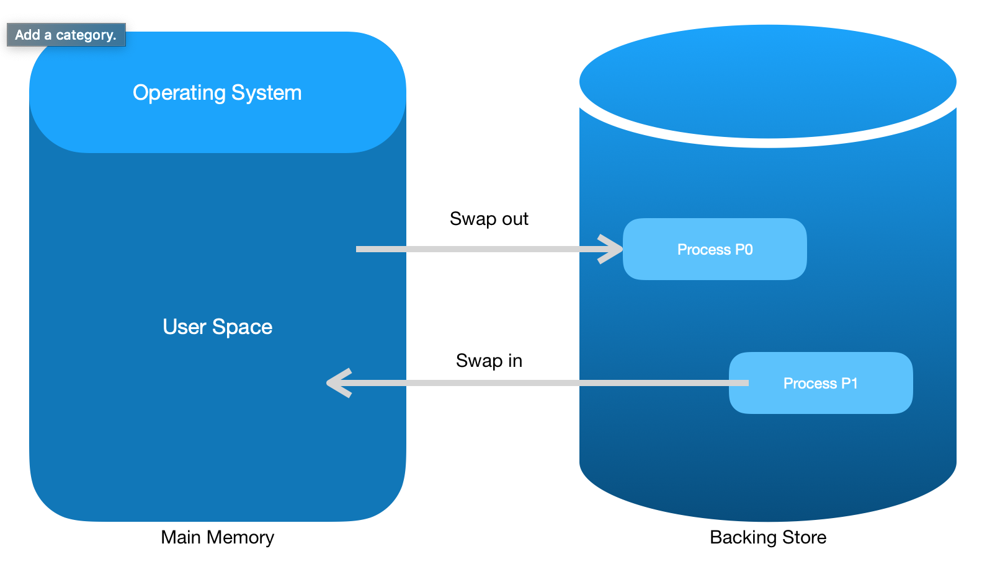

# Operating System

- [Introduction](#introduction)
	- [Memory Management](#memory-management)
	- [Process Management](#process-management)
	- [Device Management](#device-management)
	- [File Management](#file-management)
- [Operating System Processes](#operating-system-processes)
	- [Process](#process)
	- [Process Control Block (PCB)](#process-control-block-pcb)
	- [Scheduling](#scheduling)
- [Operating System Multi-Threading](#operating-system-multi-threading)
	- [Thread](#thread)
	- [Difference between Process and Thread](#difference-between-process-and-thread)
- [Memory Management (MM)](#memory-management-mm)
	- [Logical versus Physical Address Space](#logical-versus-physical-address-space)
	- [Swapping](#swapping)

## Introduction

An **operating system** (OS) is a program that acts as an interface between the user and the computer hardware and controls the execution of all kinds of programs. It provides users an environment in which a user can execute programs conveniently and efficiently.

	

Important functions of an OS:
- Memory Management
- Processor Management
- Device Management
- File Management
- Security
- Control over system performance
- Job accounting
- Error detecting aids
- Coordination between other software and users

### Memory Management

Activities for memory management:
- Keeps tracks of primary memory
- OS decides which process will get memory when and how much
- Allocates the memory when the process requests it to do so
- De-allocates the memory when the process no longer needs it or has been terminated

### Process Management

Activities:
- Keeps tracks of processor and status of process.
- Allocates the processor (CPU) to a process
- De-allocates processor when processor is no longer required

### Device Management

Activities:
- Keeps tracks of all devices
- Decides which process gets the device when and for how much time
- Allocates the device in the efficient way
- De-allocates devices

### File Management

Activities:
- Keeps tracks of information, location, uses, status, etc.
- Decides who gets the resources
- Allocates the resources
- De-allocates the resources

## Operating System Processes

### Process

Process is a program in execution.

Components:
- Object Program
- Data
- Resources
- Status: New, Ready, Running, Waiting, Terminated

	

### Process Control Block (PCB)

Each procecss is represented in the OS by a **Process Control Block (PCB)**.

PCB is the data structure used by the OS. PCB contains many pieces of information associated with a specific process.

### Scheduling

The process scheduling is:
- removal of the running process from the CPU
- selection of another process on the basis of a particular strategy
- allow more than one process to be loaded into the executable memory at a time

Process Scheduling Algorithms:
- FIFO (First In First Out) or FCFS (First Come First Serve) Scheduling
- Round Robin Scheduling
- SJF (Shortest-Job-First) Scheduling
- Priority Scheduling

## Operating System Multi-Threading

### Thread

- A **thread** is a flow of execution through the process code, with its own program counter, system registers and stack
- A **thread** is a light weight process
- Threads provide a way to improve application performance through parallelism.
- Each thread belongs to exactly one process and no thread can exist outside a process.
- Threads provide a suitable foundation for parallel execution of apps on shared memory multiprocesser

	

### Difference between Process and Thread

| Process                                                                   | Thread                                                                           |
| ------------------------------------------------------------------------- | -------------------------------------------------------------------------------- |
| heavy weight                                                              | light weight                                                                     |
| Process switching needs interaction with OS                               | Thread switching does not need to interact with OS                               |
| In multiple processing, each process has it ouw memory and file resources | All threads can share memory and resources                                       |
| If one process if blocked then no other process can execute               | While one thread is blocked and waiting, another thread in the same task can run |
| Multiple processes use more resources                                     | Multiple threaded processes use fewer resources                                  |
| In multiple processes independently of the others                         | One thread can read, write or change another thread's data.                      |

## Memory Management (MM)

- **MM** is the functionality of an OS which handles or manages primary memory.
- **MM** keeps and checks track of each and every memory location either it is allocated to some process or it is free.
- **MM** tracks whenever some memory gets freed or unallocated and correspondingly it updates the status.

### Logical versus Physical Address Space

- Logical address (Virtual address) is an address generated by the CPU
- Physical address - actually available on memory unit.
- The set of all logical addresses generated by a program is referred to as a logical address space
- The set of all physical addresses corresponding to these logical addresses is referred to as a logical address space
- The run-time mapping from virtual to physical address is done by the **memory management unit** (MMU) which is a hardware device.

### Swapping

Swapping is a mechanism in which a process can be swapped temporarily out of main memory to a backing store, and the brought back into memory for continued execution.

Backing store is usually a hard disk.

	

[Image 1]: ../img/os.position.png
[Image 2]: ../img/os.process.status.png
[Image 3]: ../img/os.thread.png
[Image 4]: ../img/os.swapping.png