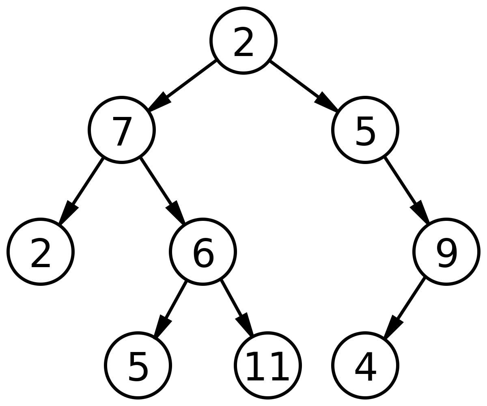

# Data Structure

- [Arrays, Iteration, Invariants](#arrays-iteration-invariants)
  - [Arrays](#arrays)
  - [Loops and Iteration](#loops-and-iteration)
  - [Invariants](#invariants)
- [Lists, Recursion, Stacks, Queues](#lists-recursion-stacks-queues)
  - [Linked Lists](#linked-lists)
  - [Recursion](#recursion)
  - [Stacks](#stacks)
  - [Queues](#queues)
  - [Doubly Linked Lists](#doubly-linked-lists)
- [Searching](#searching)
  - [Linear Search](#linear-search)
  - [Binary Search](#binary-search)
- [Efficiency and Complexity](#efficiency-and-complexity)
  - [Time versus place complexity](#time-versus-place-complexity)
  - [Big-O notation for Complexity Class](#big-o-notation-for-complexity-class)
- [Trees](#trees)
  - [General Specification of Trees](#general-specification-of-trees)
  - [Quad-Trees](#quad-trees)
  - [Binary Trees](#binary-trees)
- [Binary Search Trees](#binary-search-trees)
- [Priority Queues and Heap Trees](#priority-queues-and-heap-trees)
- [Sorting](#sorting)
- [Hash Tables](#hash-tables)
- [Graphs](#graphs)

## Arrays, Iteration, Invariants

### Arrays

In CS, the obvious way to store an ordered collection of items is as an **array**. Array items are typically stored in a sequence of computer memory locations.

### Loops and Iteration

The standard approach in most programming languages for repeating a process a certain number of times, such as moving sequenctially through an array to perform the same operations on each item, involves a **loop**.

```java
for (i=0; i<N; i++) {
    // do something
}
```

There is **iteration** over the index **i**.

### Invariants

An invariants, as the name suggests, is a condition that does not change during execution of a given program or algorithm.

For example:

- Simple inequality: `i < 20`
- Something more abstract: `the items in the array are sorted`

Invariants are important for data structures and algorithms because they enable **correctness proofs** and **verification**

## Lists, Recursion, Stacks, Queues

### Linked Lists

Non-empty **lists** can be represented by **two cells**, in each of which the first cell contains a _pointer_ to a list **element** and the second cell contains a _pointer_ to either the empty list or another two-cell.

For instance, the list `[3, 1, 4, 2, 5]`

![Image 1]

### Recursion

For-loops was a natural way to process collections of items stored in arrays. When items are stored as linked-lists, there is no index for each item, and recursion provides the natural way to process.

### Stacks

**Stack** are, on an abstract level, equivalent to linked lists. They are the ideal data structure to model a First-In-Last-Out (FILO), or Last-In-First-Out (LIFO), strategy in search.

Their relation to linked lists means that their graphical representation can be the same, but different in the orider of the items.

For instance, stack `[3, 1, 4, 2, 5]`

![Image 2]

### Queues

A **queue** is a data structure used to model a First-In-First-Out (FIFO) strategy. Conceptually, we add to the end of a queue and take away elements from its front

A queue can be graphically represented in a similar way to a list or stack, but with an additional two-cell in which the first element points to the front of the list of all the elements in the queue, and the second element points to the last element of the list.

For instance, queue `[3, 1, 4, 2]`

![Image 3]

### Doubly Linked Lists

A **doubly linked** list might be useful when working with something like a list of web pages, which has each page containing a picture, a link to the previous page, and a link to the next page.

Non-empty doubly linked lists can be represented by three-cells, where the first cell contains a pointer to another three-cell or to the empty list, the second cell contains a pointer to the list element and the third cell contains a pointer to another three-cell or the empty list

For instance, list `[3, 1, 4, 2, 5]`

![Image 4]

## Searching

### Linear Search

```java
for (i=0; i<n; i++) {
    if (a[i] == x) return i;
}
return -1;
```

### Binary Search

```java
int a = [1, 3, 4, 4, 6, 17, 79, 81, 90]; //sorted array
int n = a.count;
int x = 79;

int left = 0, right = n-1, mid;
while (left < right) {
    mid = (left + right) / 2;
    if (x > a[mid]) left = mid + 1
    else right = mid;
}
if (a[left] == x) return left;
else return -1;
```

## Efficiency and Complexity

### Time versus place complexity

**Time Complexity** of the algorithm as an indicator of how the execution time depends on the size of the data structure.

**Space Complexity** as how the memory requirement depends on the size of the data structure.

### Big-O notation for Complexity Class

**Big-O notation**, describes the time complexity of an algorithm.

- O(1)
- O(log2log2(n))
- O(log2(n))
- O(n)
- O(nlog2(n))
- O(n^2)
- O(n^3)
- O(2^n)

## Trees

### General Specification of Trees

<p align="center">
    
</p>

### Quad-Trees

<p align="center">
    
</p>

### Binary Trees

<p align="center">
    
</p>

## Binary Search Trees

## Priority Queues and Heap Trees

## Sorting

## Hash Tables

## Graphs

[Image 1]: ../img/ds.linked-lists.png
[Image 2]: ../img/ds.stacks.png
[Image 3]: ../img/ds.queues.png
[Image 4]: ../img/ds.doubly-lists.png
[Image 5]: ../img/ds.trees.png
[Image 6]: ../img/ds.binary-trees.png
