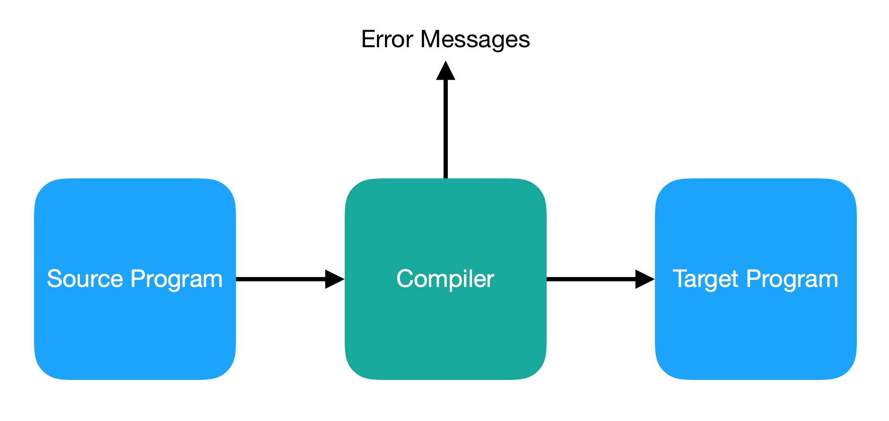
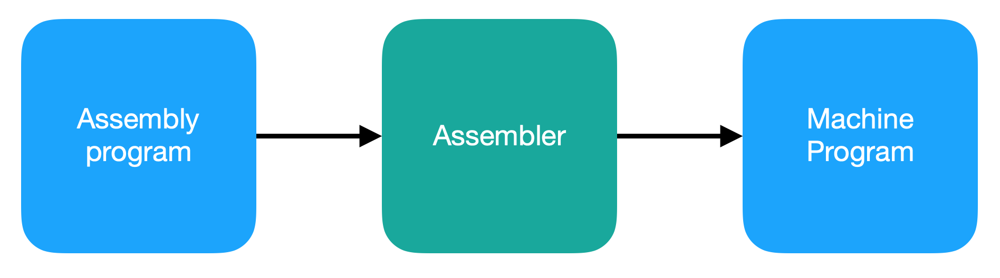
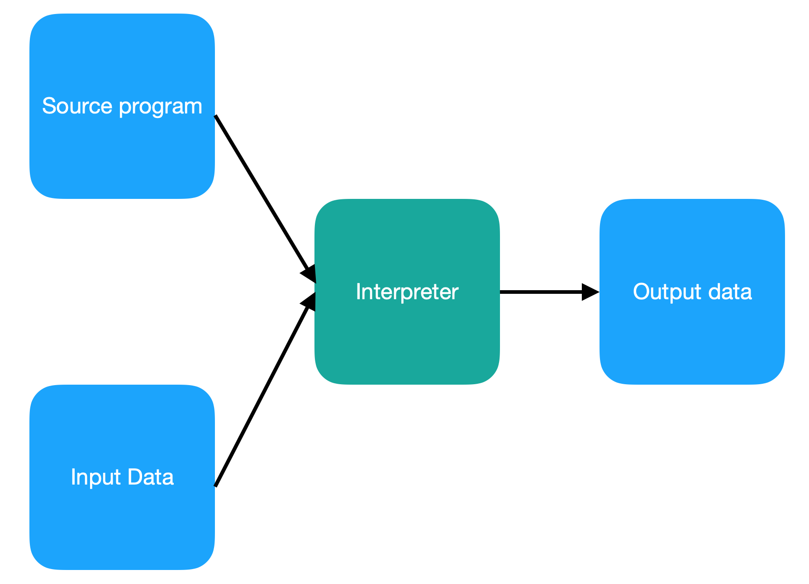

# Compiler

- [Introduction](#introduction)
  - [Compilation](#compilation)
  - [Type of Translator](#type-of-translator)

## Introduction

### Compilation

Compilation is a process that translates a program in one language (the source language) into an equivalent program in another language (the object or target language).

    

An important part of any compiler is the detection and reporting of **errors**

Commonly, the **source language** is a high-love programming language, and the **target language** is a machine learning or assembly language

### Type of Translator

An assembler is also a type of **translator**

    

An **interpreter** is closely related to a compiler, but takes both **source program** and **input data**. The translation and execution phases of the source program are one and the same.

    

[Image 1]: ../img/c.compiler.png
[Image 2]: ../img/c.assembler.png
[Image 3]: ../img/c.interpreter.png