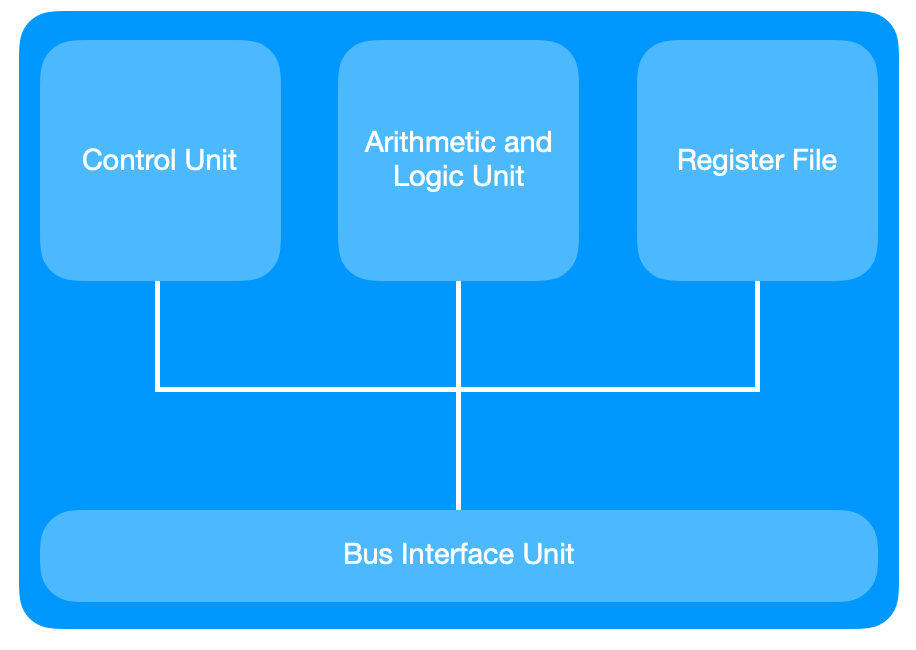

# Computer Architecture and Microprocessing

- [Overview](#overview)
  - [Computer](#computer)
  - [Classification of Computers](#classification-of-computers)
  - [Computer Architecture](#computer-architecture)
  - [Components of Computer](#components-of-computer)
- [Computer System](#computer-system)
  - [Components](#components)

## Overview

### Computer

**Computer** is an electronic device that manupulates information, or data. It has the ability to **store**, **retrieve**, and **process** data.

Computer works:
- Get input
- Process input with commands which is saved into computer.
- Give output

A computer program is a collection of instructions that performs a specific task when executed by a computer. 

A computer requires programs to function.

![Image 1]

### Classification of Computers

- Microcomputers
- Minicomputers
- Mainframe Computers
- Supercomputers

Modern computers:
- Personal Mobile Device: Smartphone, Tablet, ...
- Desktop Computers
- Server Computers
- Clusters/Warehouse Scale Computers
- Embedded Computers

### Computer Architecture

Computer Architecture is a specification describing how hardware and software technologies interact to create a computer platform or system.

Computer Architecture consists of three main categories:
- Instruction Set Architecture: The inclides the CPU's functions and capabilities, the CPU's programming language, data formats, ...
- Micorarchitecture: This defines the data processing and storage element or data paths and how they should be implemented.
- System design: Tihs includes all the hardware parts, such as CPU, data processors, ...

### Components of Computer

    

Central Processing Unit: The CPU sends signals to control the other parts of the computer, almost like how brain controls a body.

Main Memory (Random Access Memory - RAM): Store operating system software, software applications and other information.

Input/Output: Interact information between computer and another devices.

System Bus: Connects the major components of a computer system, combining the functions of a **data bus** to carry information, an **address bus** to determine where it should be sent, and a **control bus** to determine its operation.

## Computer System

### Components

CPU, controls operations of computer, process the data. CPU acts based on the program inside the main memory

    

[Image 1]: ../img/ca.computer.png
[Image 2]: ../img/ca.structure.png
[Image 3]: ../img/ca.cpu.png