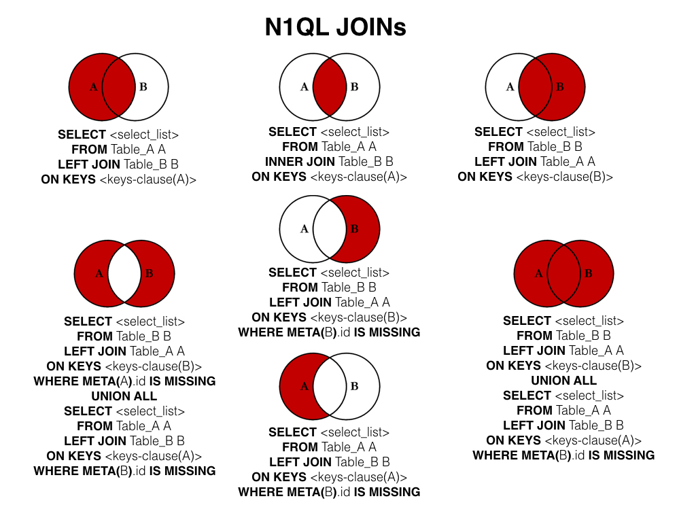

# Database

- [What is Database?](#what-is-database)
- [RDBMS Terminology](#rdbms-terminology)
- [Create Database](#create-database)
- [Drop a Database](#drop-a-database)
- [Select Database](#select-database)
- [Data Types](#data-types)
- [Create Table](#create-table)
- [Drop Table](#drop-table)
- [Insert Query](#insert-query)
- [Select Query](#select-query)
- [WHERE Clause](#where-clause)
- [Update Query](#update-query)
- [Delete Query](#delete-query)
- [Like Clause](#like-clause)
- [Sorting Result](#sorting-result)
- [JOIN](#join)
- [NULL Values](#null-values)
- [REGEXP](#regexp)
- [Transactions](#transactions)
- [ALTER Command](#alter-command)
- [Indexes](#indexes)
- [Handling Duplicates](#handling-duplicates)
  - [Preventing Duplicates from Occurring in a Table](#preventing-duplicates-from-occurring-in-a-table)

## What is Database?

A database is an organized collection of data.

Relational database management systems (RDBMS) - is called relational database because all the data is stored into different tables and relations are established using primary keys or other keys known as Foreign Keys. DBMS has one or more distinct APIs for creating, accessing, managing, searching and replicating the data it holds.

## RDBMS Terminology

- **Database**: A database is a collection of tables, with related data.
- **Table**: A table is a matrix with data. A table in a database looks like a simple spreadsheet.
- **Column**: One column (data element) contains data of one and the same kind, for example the column postcode.
- **Row**: A row is a group of related data, for example the data of one subscription.
- **Redundancy**: Storing data twice, redundantly to make the system faster
- **Primary Key**: A primary key is unique. A key value can not occur twice in one table. With a key, you can only fine one row.
- **Foreign Key**: A foreign key is the linking pin between two tables.
- **Compound Key**: A compound key is a key that consists of multiple columns, because one column is not sufficiently unique.
- **Index**: An index in a database resembles an index it the back of a book.
- **Referential Integrity**: Referantial Integrity makes sure that a foreign key value always points to an existing row.

## Create Database

```sql
CREATE DATABASE database_name;
```

## Drop a Database

```sql
DROP DATABASE database_name;
```

## Select Database

```sql
USE database_name;
```

## Data Types

- Numeric
  - M: the display length
  - D: the number of decimals
- Date and Time.
- String Types.

## Create Table

```sql
CREATE TABLE table_name (column_name column_type);
```

For example:
```sql
create table users(
   id INT NOT NULL AUTO_INCREMENT,
   name VARCHAR(100) NOT NULL,
   birth_day DATE,
   PRIMARY KEY ( id )
);
```

## Drop Table

```sql
DROP TABLE table_name;
```

## Insert Query

To insert data into a table

```sql
INSERT INTO table_name (field1, field2, ..., fieldN) VALUES (value1, value2, ..., valueN);
```

## Select Query

Used to fetch data from database

```sql
SELECT field1, field2, ..., fieldN FROM table_name
```

With offset and limit to get the results in position and the total of results you want.

```sql
SELECT field1, field2, ..., fieldN FROM table_name OFFSET 0 LIMIT 10
```

## WHERE Clause

Used to filter out the results

```sql
SELECT field1, field2, ..., fieldN table_name
WHERE condition1 [AND [OR]] condition2, ...
```

## Update Query

```sql
UPDATE table_name SET field1 = new-value1, field2 = new-value2
[WHERE Clause]
```

## Delete Query

```sql
DELETE FROM table_name [WHERE Clause]
```

## Like Clause

Used like **=** in `WHERE` clause, but use **LIKE** when we want to filter out all the results where the value contains some characters.

```sql
SELECT field1, field2,...fieldN table_name1
WHERE field1 LIKE condition1 [AND [OR]] filed2 = 'somevalue'
```

When **LIKE** is used along with `%` sign then it work like a meta character search.

## Sorting Result

Sort a result set by adding an **ORDER BY** clause that names the column or columns which you want to sort.

```sql
SELECT field1, field2,...fieldN table_name1
ORDER BY field1 ASC;

SELECT field1, field2,...fieldN table_name1
ORDER BY field1, field2 DESC, ASC;
```

## JOIN

Used **JOIN** to use multiple tables in single SQL query.

- LEFT JOIN
- RIGHT JOIN 
- INNER JOIN

<p align="center">
    
</p>

## NULL Values

Use **NULL** in **WHERE** clause

```sql
IS NULL
IS NOT NULL
<=>
```

## REGEXP

MySQL supports another type of pattern matching operation based on the regular expressions and the **REGEXP** operator

| Patter         | What the pattern matches                               |
| -------------- | ------------------------------------------------------ |
| ^              | Beginning of string                                    |
| $              | End of string                                          |
| .              | Any single character                                   |
| [...]          | Any character listed between the square brackets       |
| [^...]         | Any character not listed between the square brackets   |
| p1 or p2 or p3 | Alternation; matches any of the patterns p1, p2, or p3 |
| *              | Zero or more instances of preceding element            |
| +              | One or more instances of preceding element             |
| {n}            | n instances of preceding element                       |
| {m,n}          | m through n instances of preceding element             |

## Transactions

A transaction is a sequential group of database manipulation operations, which is performed as if it were one single work unit. In other words, a transaction will never be complete unless each individual operation within the group is successful. If any operation within the transaction fails, the entire transaction will fail.

The transactions begin with the statement `BEGIN WORK` and end with either a `COMMIT` or a `ROLLBACK` statement. The SQL commands between the beginning and ending statements form the bulk of the transaction.

## ALTER Command

ALTER command is very useful when you want to change a name of your table, any table field or if you want to add or delete an existing column in a table.

## Indexes

A database index is a data structure that improves the speed of operations in a table. Indexes can be created using one or more columns, providing the basis for both rapid random lookups and efficient ordering of access to records.

The users cannot see the indexes, they are just used to speed up queries and will be used by the Database Search Engine to locate records very fast.

The INSERT and UPDATE statements take more time on tables having indexes, whereas the SELECT statements become fast on those tables. The reason is that while doing insert or update, a database needs to insert or update the index values as well.

```sql
CREATE UNIQUE INDEX index_name ON table_name ( column1, column2,...);
```

## Handling Duplicates

### Preventing Duplicates from Occurring in a Table

Use a `PRIMARY KEY` or a `UNIQUE` Index on a table with the appropriate fields to stop duplicate records.

Use the `INSERT IGNORE` command rather than the `INSERT` command. If a record doesn't duplicate an existing record, then MySQL inserts it as usual. If the record is a duplicate, then the `IGNORE` keyword tells MySQL to discard it silently without generating an error.

Use the `REPLACE` command rather than the `INSERT` command. If the record is new, it is inserted just as with `INSERT`. If it is a duplicate, the new record replaces the old one.

[Image 1]: ../img/sql.join.jpeg
