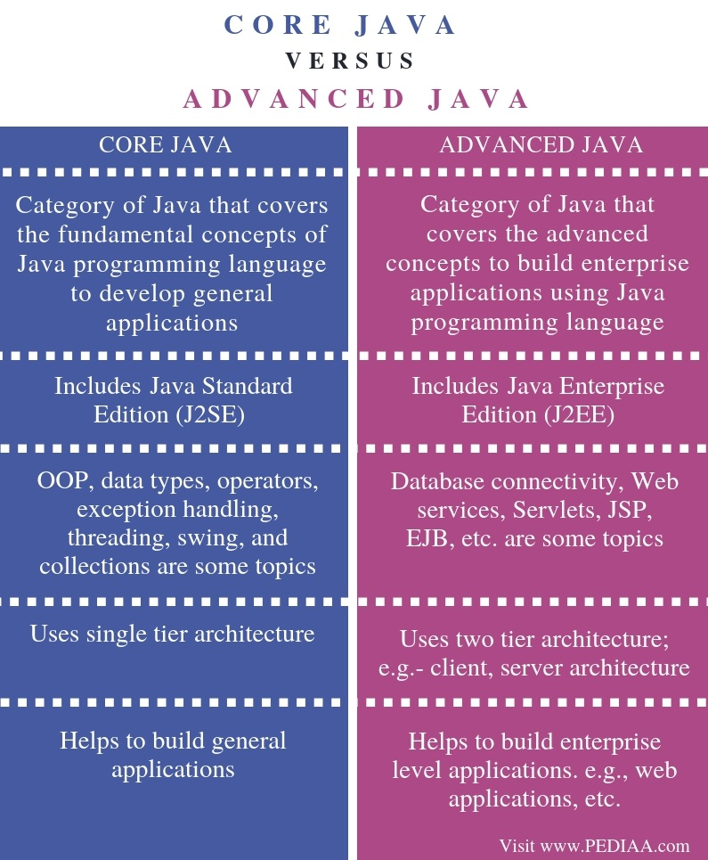

# Java Programming

- [Java](#java)
- [Properties](#properties)
- [What is Core Java](#what-is-core-java)
- [What is Advanced Java](#what-is-advanced-java)
- [Relationship Between Core Java and Advanced Java](#relationship-between-core-java-and-advanced-java)
- [Difference Between Core Java and Advanced Java](#difference-between-core-java-and-advanced-java)
  - [Definition](#definition)
  - [Java Version](#java-version)
  - [Topics or Areas](#topics-or-areas)
  - [Architecture](#architecture)
  - [Applications](#applications)

## Java

Java is a high-level programming language originally developed by Sun Microsystems and released in 1995. Java runs on a variety of platforms, such as Windows, Mac OS, and the various versions of UNIX.

Java is guaranteed to be **Write Once**, **Run Anywhere**

## Properties

**Object Oriented** - In Java, everything is an Object. Java can be easily extended since it is based on the Object model.

**Platform Independent** - Unlike many other programming languages including C and C++, when Java is compiled, it is not compiled into platform specific machine, rather into platform independent byte code. This byte code is distributed over the web and interpreted by the Virtual Machine (JVM) on whichever platform it is being run on.

**Simple** - Java is designed to be easy to learn. If you understand the basic concept of OOP Java, it would be easy to master.

**Secure** - With Java’s secure feature it enables to develop virus-free, tamper-free systems. Authentication techniques are based on public key encryption.

**Multithreaded** - With Java's multithreaded feature it is possible to write programs that can perform many tasks simultaneously. This design feature allows the developers to construct interactive applications that can run smoothly.

**High Performance** - With the use of Just-In-Time compilers, Java enables high performance.

**Dynamic** - Java is considered to be more dynamic than C or C++ since it is designed to adapt to an evolving environment.

    

## What is Core Java

Core Java mainly focuses on building general applications. Java Standard Edition (J2SE) is categorized as Core Java. Core Java mainly covers object-oriented programming concepts. The main OOP pillars are encapsulation, inheritance, abstraction and polymorphism. They are as follows.

Encapsulation – Combines data and methods to a single unit
 
Inheritance – Allows using an already created class without writing the code from the beginning, improving the code reusability

Polymorphism – Allows writing code in a way that an object can behave in multiple ways

Abstraction – Allows writing the code in a way that hides the implementation details to reduce complexity.

Core Java helps to implement the above concepts when developing software.

## What is Advanced Java

Advanced Java is the level ahead of Core Java, and covers more advanced concepts such as web technologies, and database accessing. Java Enterprise Edition (J2EE) is categorized as Advanced Java.

Advanced Java covers a number of topics. JDBC stands for Java Database Connectivity. It is a standard Java API to build independent connectivity between the Java language based application and databases such as MySQL, MSSQL, and, Oracle. Additionally, Servlets and JSP allow developing dynamic web applications. EJB provide distributed and highly transactional features to build enterprise applications. Furthermore, Java web services help to build SOAP and RESTful web services. They provide a common platform for the applications to communicate with each other.

## Relationship Between Core Java and Advanced Java

Advanced Java depends on Core Java. As a result, it is not possible to develop applications using Advanced Java without Core Java knowledge.

## Difference Between Core Java and Advanced Java

### Definition
Core Java is the category of Java that covers the fundamental concepts of Java programming language to develop general applications. Advanced Java is the category of Java that covers the advanced concepts to build enterprise applications using Java programming language. Hence, this explains the main difference between Core Java and Advanced Java.

### Java Version
Java Standard Edition (J2SE) comes under Core Java while Java Enterprise Edition (J2EE) omes under Advanced Java.

### Topics or Areas
OOP, data types, operators, exception handling, threading, swing, and collections are some topics in Core Java. In contrast, database connectivity, web services, Servlets, JSP, EJB, etc. are some topics in Advanced Java.

### Architecture
Furthermore, core Java uses single tier architecture. In contrast, Advanced Java uses two-tier architecture. e.g.- client, server architecture. This is a major difference between Core Java and Advanced Java.

### Applications
Another ifference between Core Java and Advanced Java is that Core Java helps to build general applications while advanced Java helps to build enterprise level applications. e.g., web applications, etc.

[Image]: ../img/java.jpg
