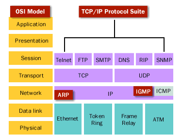
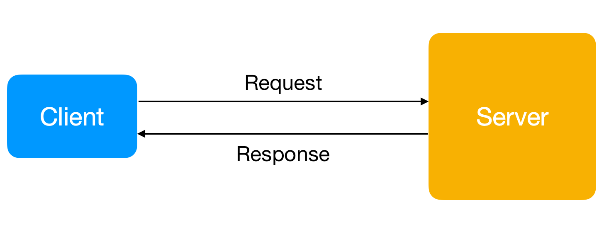

# Network Programming

- [Introduction](#introduction)
  - [Network Architecture](#network-architecture)
  - [Network Programming](#network-programming)
  - [Types of Network](#types-of-network)
  - [Operating System](#operating-system)
  - [Protocols](#protocols)
- [Models of Network](#models-of-network)
  - [OSI Model](#osi-model)
  - [TCP/IP Model](#tcpip-model)
  - [Internet Layer](#internet-layer)
  - [Network Interface Layer / Link Layer](#network-interface-layer--link-layer)
- [Server/Client Model](#serverclient-model)
  - [Client](#client)
  - [Server](#server)
  - [Activity](#activity)
  - [Characteristic](#characteristic)
  - [Protocol for Client/Server Model](#protocol-for-clientserver-model)
- [TCP](#tcp)
  - [Socket](#socket)
- [UDP](#udp)

## Introduction

### Network Architecture

Netowrk Architecture is the design of a computer network.

#### Network topology: 

The arrangement of a network which comprises of nodes and connecting lines via sender and receiver.

    

#### Layered Architecture

The basic idea of a layered architecture is to divide the design into smaill peaces.

System of network protocol consists:

- Hardwares
- Software

For example: OSI or TCP/IP Model Layers
  
### Network Programming

Network programming is create entity softwares that working on a particular layer. Using softwares of lower layer and provide services for higher layer.

People usually create entity software for `application layer`, provide services for user.

### Types of Network

#### LAN

- Bandwidth: High
- Error rate: Low
- Appropriate with applications: Email, File Transfer, Database application, Multi-media transfer.

#### WAN

- Install techniques: 
  - Lease-line, Frame-relay, ISDN, ATM...
  - Each technique have different bandwidth
- Applications: Data Communication, VoIP,...

#### Internet
- Unstable and unsafe compared with LAN and WAN
- Applications: Email, Web, E-Commerce, Game Online
- Cyber network security

### Operating System

One Network Application works on one or more computer systems.

To work, the application needs an operating environment and the most important environment is: Operating System.

- UNIX
- LINUX
- Windows
- macOS

### Protocols

- TCP/IP suite

    

## Models of Network

### OSI Model

    

#### Application

Protocol data unit: Data.
High-level APIs, including resource sharing, remote file access.

#### Presentation

Protocol data unit: Data.

Translation of data between a networking service and an application; including character encoding, data compression and encryption/decryption.

#### Session

Protocol data unit: Data.

Managing communication sessions, i.e. continuous exchange of information in the form of multiple back-and-forth transmissions between two nodes

#### Transport	

Protocol data unit: Segment, Datagram

Reliable transmission of data segments between points on a network, including segmentation, acknowledgement and multiplexing.

#### Network

Protocol data unit: Packet.

Structuring and managing a multi-node network, including addressing, routing and traffic control.

#### Data link

Protocol data unit: Frame.

Reliable transmission of data frames between two nodes connected by a physical layer

#### Physical

Protocol data unit: Symbol.
Transmission and reception of raw bit streams over a physical medium.

### TCP/IP Model

    

#### Application Layer

The **application layer** is the scope within which applications, or processes, create user data and communicate this data to other applications on another or the same host.

#### Transport Layer

The **transport layer** performs host-to-host commnunications on either the same or different hosts and on either the local network or remote networks separated by routers.

It provides a channel for the communitation needs of applications. UDP is the basic transport layer protocol, providing an unreliable datagram service.

### Internet Layer

The **internet layer** exchanges datagrams across network boundaries. It provides a uniform networking interface that hides the actual topology of the underlying network connections.

### Network Interface Layer / Link Layer

The layer defines the networking methods within the scope of the local netowrk link on which hosts communicate without intervening routers. This layer includes the protocols used to describe the local network topology and the interfaces needed to affect transmission of Internet layer datagrams to next-neighbor hosts.

## Server/Client Model

    

### Client

- Create a connection to the server (speaks first)
- Request a particular service from the server
- With web, client is into the web browser

### Server

- Provide requested service for the client

### Activity

    

### Characteristic

- Encapsulation
  - The server have all business logic
  - The server can upgrade without affect to the client
- Centralization
  - Access resources with security
- Scalability
  - Can upgrade server or client anytime if needed
- Flexibility
  - New technology can easily intergrate to system
- Interoperability
  - All components (clients, network, servers) work together

### Protocol for Client/Server Model

A network protocol is a set of established rules that dictates how to format, transmit and receive data so computer network devices can communicate regardless of the differences in their underlying infrastructures, designs and standards.

When create an application with Client/Server, you need to design an protocol.
Some popular protocols: FTP, HTTP, etc.

#### Types of Protocol

- Synchronous protocol: 
  - Communication between client and server in 2 directions but concurrent.
  - Operate step by step
  - Example: HTTP SMTP, POP3
- Asunchronous protocol:
  - Client and Server can send information at the same time
  - Example: TELNET, RLOGIN

## TCP

Transmission Control Protocol is a connection-oriented protocol, which means a connection is established and maintained until the application programs at each end have finished exchanging messages.

TCP cover parts of Layer 4 and parts of Layer 5 in OSI.

> Some protocols is a connection-oriented: HTTP, FTP, Telnet

### Socket

A network socket is an internal endpoint for sending or receiving data within a node on a computer network.

#### Types

- Stream Sockets: Provides a connection-oriented, sequenced, and unique flow of data without record boundaries, with well-defined mechanisms for creating and destroying connections and for detecting errors. (TCP socket)
- Datagram Sockets: Provides a connectionless point for sending or receiving data packets (UDP socket)
- Raw Sockets: Allows direct sending and receiving of IP packets without any protocol-specific transport layer formatting.
  
## UDP

UDP - User Datagram Protocol, with UDP, computer application can send messages, in this case referred to as **datagrams**.

UPD uses a simple connectionless communication model.

[Network Topology]: ../img/np.network.topology.png
[TCP/IP Suite]: ../img/np.tcpip.suite.png
[OSI Model]: ../img/np.osi.model.png
[TCP/IP Model]: ../img/np.tcpip.model.png
[Client And Server]: ../img/np.cns.png
[CnS Activity]: ../img/np.cns.activity.png