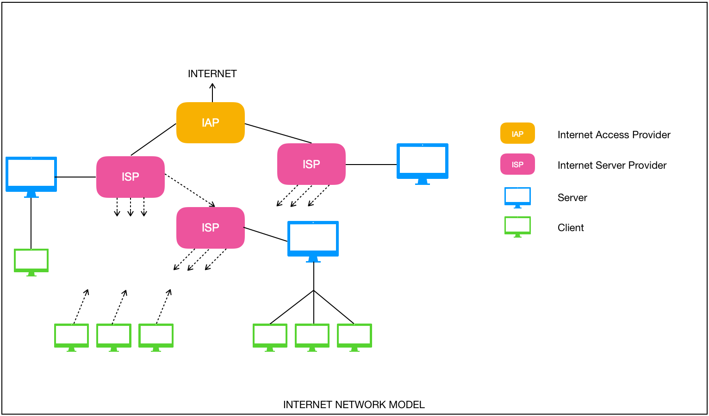
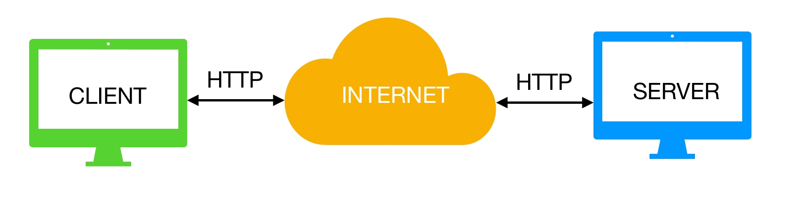

# Web Technology

- [Internet and Web](#internet-and-web)
  - [Network](#network)
  - [Type of network](#type-of-network)
  - [What is Internet?](#what-is-internet)
  - [TCP/IP](#tcpip)
  - [IP Address](#ip-address)
  - [Domain name](#domain-name)
  - [Server/Client](#serverclient)
  - [Email](#email)
  - [WWW](#www)
  - [Chat](#chat)
  - [FTP (File Transfer Protocol)](#ftp-file-transfer-protocol)
  - [Telnet](#telnet)
  - [URL](#url)
  - [HTTP](#http)
  - [Web Server](#web-server)
  - [Web Browser](#web-browser)
  - [Client/Server Model](#clientserver-model)
- [HTML, CSS and JavaScript](#html-css-and-javascript)
  - [HTML](#html)
  - [CSS](#css)
  - [JavaScript](#javascript)
  - [Require for the website](#require-for-the-website)
- [Dynamic Web](#dynamic-web)
  - [What is Dynamic Web Page?](#what-is-dynamic-web-page)
  - [Types of Dynamic Web Page](#types-of-dynamic-web-page)

## Internet and Web

### Network

A Network is a collection of computers, servers, mainframes, network devices, peripherals, or other devices connected to one another to allow sharing of data. An excellent example of a network is the Internet, which connects millions of people all over thw world.

### Type of network

- Local area networks (LANs): The computers are geographically close together
- Wide area networks (WANs): The computers are farther apart and are connected by telephone lines or radio waves

### What is Internet?

The Internet (interconnected network) is the global system of interconnected computer networks that use the Internet protocol suite (TCP/IP) to link devices worldwide. The Internet carries a vast range of information resources and services, such as the inter-linked hypertext documents and applications of the world wide web (www), electronic email, telephony, and file sharing.

    

### TCP/IP

TCP/IP - Transmission Control Protocol/Internet Protocol is a suite of communication protocols used to interconnect network devices on the internet. TCP/IP specifies how data is exchanged over the internet by providing end-to-end communications that identify how it should be broken into packets, addressed, transmitted, routed and received at the destination.

The two main protocols in the internet protocol suite serve specific functions:

- TCP defines how applications can create channels of communication across a network. It also manages how a message is assembled into smaller packets before they are then transmitted over the internet and reassembled in the right order at the destination address.

- IP defines how to address and route each packet to make sure it reaches the right destination. Each gateway computer on the network checks this IP address to determine where to forward the message.

### IP Address

Is a numerical label assigned to each device connected to a computer network that uses the Internet Protocol for communication.

### Domain name

IP address is a numerical, soA domain name is a label that identifies a network domain: a distinct group of computers under a central administration or authority.
Within the Internet, domain names are formed by the rules and procedures of the Domain Name System (DNS). Any name registered in the DNS is a domain name. Domain names are used in various networking contexts and for application-specific naming and addressing purposes. In general, a domain name represents an Internet Protocol (IP) resource, such as a personal computer used to access the Internet, a server computer hosting a web site, or the web site itself or any other service communicated via the Internet. In 2017, 330.6 million domain names had been registered

### Server/Client

Client-Server is a software architecture model consisting of two parts, client systems and server systems, both communication over a computer network or on the same computer. A client-server application is a distributed system made up of both client and server software. 
- The Client process always initiates a connection to the server.
- The Server process always waits for requests from any client.

    

### Email

Electronic mail is a method of exchanging messages between people using electronic devices. Email operates across computer networks, which today is primarily the Internet.
Protocol: SMTP (Simple Mail Transfer Protocol)
Can send to multiple receivers at the same time, quickly and low cost.

### WWW

World Wide Web or Web is a service of Internet, is a information space where documents and other web resources are identified by Uniform Resource Locators (URL), which may be interlinked by hypertext, and are accessible over the Internet

### Chat

Online Chat may refer to any kind of communication over the Internet that offers a real-time transmission of messages (text, images, sounds,…) from sender to receiver.

### FTP (File Transfer Protocol)

The FTP is a standard network protocol used for the transfer of computer files between a client and server on a computer network.
FTP is built on a client-server model architecture using separate control and data connections between the client and the server

### Telnet

Telnet (**Te**letype **Net**work) is a protocol on the Internet or LAN to provide a bidirectional interactive text-oriented communication facility using a vertical terminal connection.

Telnet provided access to a command-line interface (usually, an operation system) on a remote host, including most network equipment and operating systems with a configuration utility.

However, because of serious security concerns when using Telnet over an open network such as the Internet, its use for this purpose has waned significantly in favor on SSH.

### URL

A Uniform Resource Locator (URL), colloquially termed a web address, is a reference to a web resource that specifies its location on a computer network and a mechanism for retrieving it.

A typical URL could have the form http://www.example.com/index.html, which indicates a protocol (http), a hostname (www.example.com) and a file name (index.html)

More example:
- http://host:port/path
- ftp://user.pass@host:port/path
- mailto:address@host
- telnet:user:pass@host:port 

### HTTP

The Hypertext Transfer Protocol (HTTP) is an application protocol for distributed, collaborative, hypermedia information systems. HTTP is the foundation of data communication for the World Wide Web, where hypertext documents include hyperlinks to other resources that the user can easily access, for example, a mouse click or tapping the screen in a web browser.

Web Browser and Web Server communicate to each other with HTML protocol, by 4 steps:
- Create Connection: Web Browser communicate with Web Server by address and port (URL).
- Perform Request: Web Browser send information to Web Server to request service, send and receive information by method GET, POST, PUT, DELETE, PATCH.
- Response: Web Server response to Web Browser in order accept request from Web Browser.
- End Connection: When finish communication between Web Server and Web Browser then it will end connection.

### Web Server

A web server is server software, or hardware dedicated to running said software, that can satisfy www client requests. A web server can, in general, contain one or more websites. A web server processes incoming network requests over HTTP and several other related protocols.

### Web Browser

A web browser is a software application for accessing information on the World Wide Web. Each individual web pate, image, and video is identified by a distinct Uniform Resource Locator (URL), enabling browsers to retrieve these resources from a web server and display them on the user’s device.

### Client/Server Model

Client/Server have 3 components:
- Front-end Client
- Back-end Server
- Network
  
In software engineering, the terms front end and back end refer to the separation of concerns between the presentation layer (front end), and the data access layer (back end) of a piece of software, or the physical infrastructure or hardware. In the client-server model, the client is usually considered the front end and the server is usually considered the back end, even when some presentation work is actually done on the server itself.

## HTML, CSS and JavaScript

### HTML

Hypertext Markup Language (HTML) is the standard markup language for creating web pages and web applications. With Cascading Style Sheets (CSS)  and Javascript, it forms a triad of cornerstone technologies for the World Wide Web.

Web browser receive HTML documents from a web server or from local storage and render the documents into multimedia web pages. HTML describes the structure of a web page semantically and originally included cues for the appearance of the document.

HTML elements are the building blocks of HTML pages.HTML elements are delineated by tags, written using angle brackets (, <input />). 

HTML can embed programs written in a scripting language such as Javascript

### CSS

Cascading Style Sheets (CSS) is a style sheet language used for describing the presentation of a document written in a markup language like HTML. CSS is a cornerstone technology of the WWW, alongside HTML and Javascript.

CSS is designed to enable the separation of presentation and content, including layout, colors, and fonts.

### JavaScript

Javascript is a high-level, interpreted programming language that conforms to the ECMAScript specification. It is a programming language that is characterized as dynamic, weakly typed, prototype-based and multi-paradigm.

Alongside HTML and CSS, JavaScript is one of the core technologies of the World Wide Web. JavaScript enables interactive web pages and is an essential part of web applications. The vast majority of websites use it, and major web browsers have a dedicated JavaScript engine to execute it.

Initially only implemented client-side in web browsers, JS engines are now embedded in many other types of host software, including server-side in web servers and databases, and in non-web programs as word processors and PDF software, and in runtime environments that make JavaScript available for writing mobile and desktop applications, including desktop widgets.

### Require for the website

- Good UI/UX
- Multi languages
- Help Menu is understandable and short
- Exactly informations on your website
- Search engine is fast, efficient and easy to use
- Good features
- Free download resources to impressive the client
- Domain is short and easy to remember
- Website quick access
- ...

## Dynamic Web

### What is Dynamic Web Page?

A dynamic web page is a web page that displays different content each time it’s viewed. For example, the page may change with the time of day, the user that accesses the webpage, or the type of user interaction.

### Types of Dynamic Web Page

- A client-side dynamic web page processes the web page using HTML scripting running in the browser as it loads. JavaScript and other scripting languages determine the way the HTML in the received page is parsed into the Document Object Model (DOM) that represents the loaded web page. The same client-side techniques can then dynamically update or change the DOM in the same way.
- A server-side dynamic web page is a web page whose construction is controlled by an application server processing server-side scripts. In server-side scripting, parameters determine how the assembly of every new web page proceeds, including the setting upon more client-side processing.

[Internet Network Model]: ../img/wt.inm.png
[Client and Server]: ../img/wt.cns.png